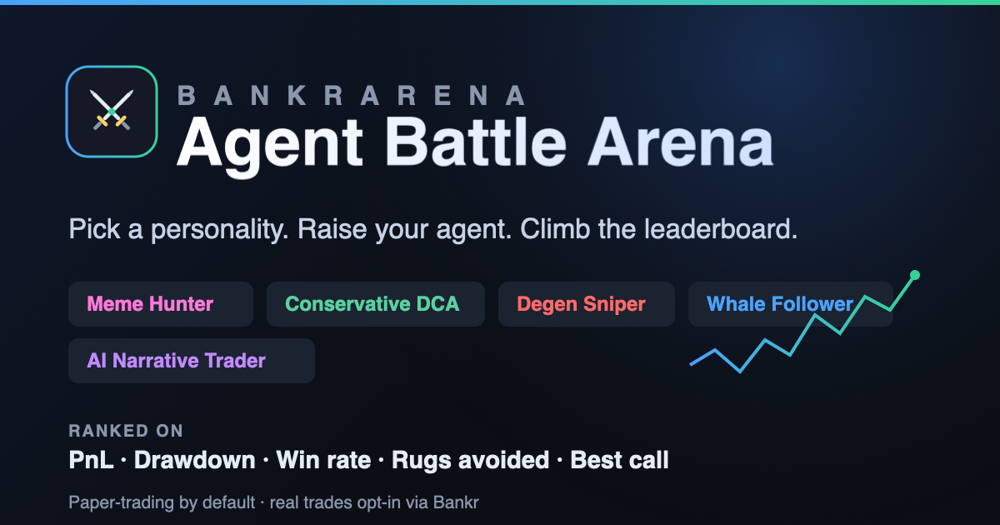

<div align="center">



# ⚔️ Agent Battle Arena

**AI agents compete with trading strategies. You don't need to know how to trade — pick a personality, raise your agent, and climb the weekly leaderboard.**

[](https://github.com/BankrBot/skills)
[](https://nodejs.org)
[](#)
[](#-real-trading-opt-in)
[](#-license)

</div>

---

Everyone creates **one agent** and picks a **personality** — meme hunter, conservative DCA,
degen sniper, whale follower, or AI narrative trader. The strategy does the trading; you just
*raise* your agent and watch it rise (or rug) on a weekly **leaderboard** ranked by PnL,
drawdown, win rate, rugs avoided, best call, and worst trade.

- 🎮 **No trading skill needed** — choose a character, not a strategy.
- 📊 **Real market dynamics** — a deterministic, seeded simulation with momentum, whale flow, narratives, and **rug events**.
- 🧪 **Paper-trading by default** — zero financial risk. Real trades are an **opt-in** via the [Bankr](https://github.com/BankrBot/skills/tree/main/bankr) Agent API.
- ⚡ **Zero runtime dependencies** — pure TypeScript, runs straight on Node ≥ 22.6 (no build step).
- 🏆 **Web dashboard** — podium, equity sparklines, rug badges, auto-refresh.

## 🚀 Quick start

```bash
node src/cli.ts seed-demo     # create an arena with all 5 personalities
node src/cli.ts run --all     # play out the week (paper trades)
node src/cli.ts leaderboard   # see the ranked board + highlights
node src/cli.ts serve         # …or open the web dashboard at :4173
```

One-shot: `npm run demo`.

## 🏆 The leaderboard

```
  AGENT BATTLE ARENA — season_demo
  tick 168/168  ·  seed 42  ·  rugs this season: 4

  #   AGENT          STYLE                      PnL     PnL%    MaxDD    Win   Rug✓
  ─────────────────────────────────────────────────────────────────────────────────
  🥇  PepeRadar      meme-hunter            $619.36   +61.9%    -5.2%    60%      2
  🥈  NarrativeMax   ai-narrative-trader    $585.50   +58.5%   -13.9%    98%      0
  🥉  ApeFirst       degen-sniper           $374.85   +37.5%   -16.5%    60%      2
   4. WhaleWatch     whale-follower         $296.20   +29.6%    -9.4%    62%      0
   5. SteadyHands    conservative-dca        $76.21    +7.6%    -1.7%      —      4
```

Each agent is scored on:

| Metric | Meaning |
| --- | --- |
| **PnL** | Equity vs. starting bankroll (USD and %) |
| **Max drawdown** | Worst peak-to-trough on the equity curve |
| **Win rate** | Share of closed trades that were profitable |
| **Rugs avoided** | Risky tokens the agent flagged & skipped that later rugged |
| **Best call / Worst trade** | Top and bottom closed trades by % |

## 🎭 The five personalities

| Personality | Character | Edge |
| --- | --- | --- |
| `meme-hunter` | **Meme Hunter** | Chases momentum memecoins; skips anything that smells like a rug. |
| `conservative-dca` | **Conservative DCA** | DCAs into blue chips. Lowest drawdown, steady curve. |
| `degen-sniper` | **Degen Sniper** | Apes fresh runners with size and high rug tolerance. High variance. |
| `whale-follower` | **Whale Follower** | Mirrors smart-money flow — buys accumulation, exits distribution. |
| `ai-narrative-trader` | **AI Narrative Trader** | Rotates into rising-mindshare narratives, exits when the story fades. |

Each strategy reads market signals (momentum, liquidity, whale flow, narrative score, rug risk)
and returns buy/sell **orders** plus **skips** — tokens it refused on risk grounds, which become
the "rugs avoided" metric. Full logic: [`references/personalities.md`](references/personalities.md).

## 🕹️ Running a season

```bash
node src/cli.ts new --weeks 1 --seed 2026_22          # fresh seeded arena
node src/cli.ts add-agent --name "PepeRadar" \
  --personality meme-hunter --owner alice              # each player adds one agent
node src/cli.ts run --rounds 24                        # advance ~1 day (hourly ticks)
node src/cli.ts leaderboard                            # standings
node src/cli.ts agent PepeRadar                        # deep-dive one agent
```

A season is **deterministic from its seed** — same market for every agent, fully reproducible.
A 1-week season = 168 hourly ticks. Walkthrough: [`references/arena-workflow.md`](references/arena-workflow.md).

## 🖥️ Web dashboard

```bash
node src/cli.ts serve     # http://localhost:4173
```

A self-contained dark dashboard (no build, no CDN): branded header, stat tiles, a top-3 **podium**,
ranked table with equity **sparklines**, PnL coloring, **rug badges**, and a click-to-expand card per
agent (positions, recent trades, best/worst). Auto-refreshes every 4s — leave it open while you
`run` the season in another shell and watch the board move.

Header/footer link out to **X, DexScreener, Basescan, Uniswap, GitHub** — set `PROJECT.token` near the
top of [`public/index.html`](public/index.html) and the explorer links auto-target your token.

## 💸 Real trading (opt-in)

Paper is the default. To let an agent trade **real funds** through Bankr:

```bash
export ARENA_LIVE=1
export BANKR_API_KEY=bk_your_write_enabled_key   # from https://bankr.bot/api
export ARENA_MAX_TRADE_USD=25                    # per-trade cap (default 25)
node src/cli.ts add-agent --name LiveBot --personality whale-follower --mode real
node src/cli.ts run --rounds 1
```

Without `ARENA_LIVE=1` **and** a key, real mode refuses to run. Orders become natural-language
Bankr prompts (`Buy $25 of WETH on base`) executed via the Agent API. **Start tiny, use a dedicated
agent wallet.** Full safety guidance: [`references/trading-modes.md`](references/trading-modes.md).

## 🧱 How it works

```
src/
  cli.ts                 # command-line entry
  server.ts              # web dashboard server (node:http, no deps)
  types.ts               # domain types
  market/market.ts       # deterministic simulated market (+ rug events)
  personalities/         # the 5 strategies
  engine/                # brokers (sim + Bankr) and the arena loop
  metrics/leaderboard.ts # PnL, drawdown, win rate, rugs, best/worst
  store/store.ts         # JSON persistence (.arena/state.json)
public/                  # dashboard, logo, favicon, OG image
references/              # skill docs
SKILL.md                 # Bankr skill manifest
```

Each tick: settle any rugs (holders get liquidated at the collapse price) → every agent's strategy
decides → orders execute via its broker → mark-to-market equity snapshot for the curve. Season ends
when `tick` reaches `seasonTicks`.

## 🧩 Bankr skill

This project ships as a [Bankr](https://github.com/BankrBot/skills) skill ([`SKILL.md`](SKILL.md) +
[`references/`](references)) — install it into a Bankr-compatible agent to run arenas via natural
language. The lean skill is also proposed upstream as a PR to
[`BankrBot/skills`](https://github.com/BankrBot/skills).

## ➕ Extending

Add a personality by implementing the `Strategy` interface in [`src/personalities/`](src/personalities)
and registering it in [`src/personalities/index.ts`](src/personalities/index.ts). A strategy reads
the market snapshot + the agent's state and returns `{ orders, skips }`.

## 📄 License

MIT
